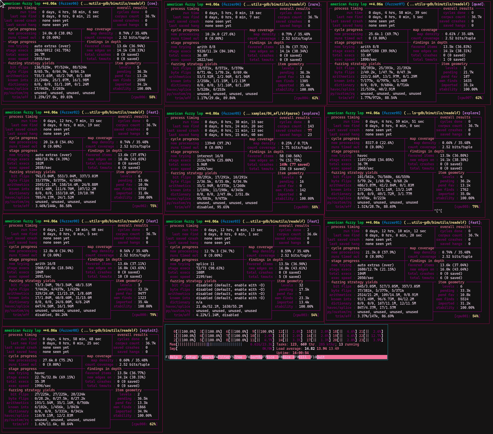

# Efforts to fuzz parsers with ELF binaries that are produced via LibGolf (or based on)

Checkout for the fuzzing strategy at 
### To-Do
- [ ] fixed input fuzzing 
### In Scope

- [x] binutils-gdb/readelf (no crash yet)
- [x] libelfmaster 
- [x] elfparser 
- [x] radare2 (1 crash) (suggested fix merged: https://github.com/radareorg/radare2/pull/21504)


## first try experiences




# Original README
## A Library for Binary Golf

This library helps with Binary Golf. The idea is to get out of your way as soon as possible, and you let you get straight to customizing fields within the ELF and Program header.

Just put your shellcode into an array called `buf[]` in a `shellcode.h` file and use the template below. See the [`examples`](./examples) for more.

Currently Supported:
* `X86_64`
* `ARM32`
* `AARCH64`

```c
// x86_64 Example

#include "libgolf.h"
#include "shellcode.h"

int main(int argc, char **argv)
{
    /*
     * Specify architecture - populate 'ehdr' and 'phdr'
     * Format: INIT_ELF(ISA, ARCH)
     * Supported:
     * - ISA: X86_64, ARM32, AARCH64
     * - ARCH: 32, 64
     */
    INIT_ELF(X86_64,64);

    /*
     * Customize any fields you'd like here.
     */
    ehdr->e_version = 0x13371337

    /*
     * Generate the ELF file and cleanup
     */
    GEN_ELF();
    return 0;
}
```
